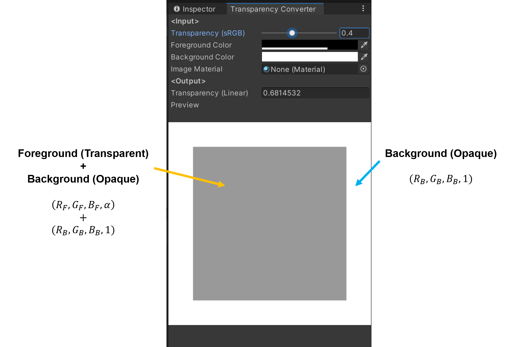
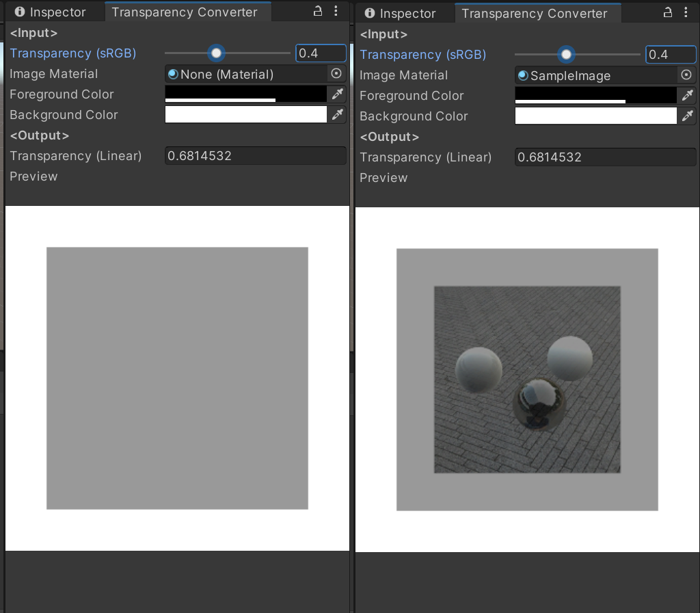
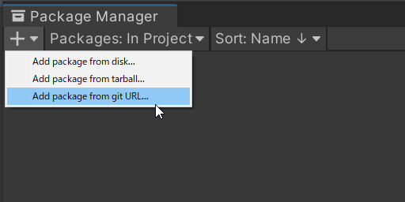
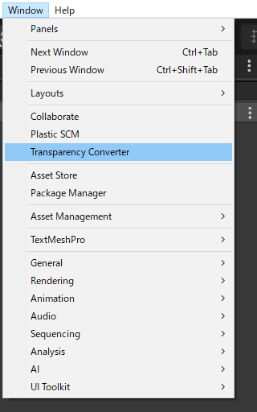

# Transparency Converter

Transparency Converterは、sRGB色空間の透明度の値からリニア色空間の透明度の値を計算するためのUnityパッケージです。  
これを使うことにより、開発者/デザイナーは、外部ツールを使ってsRGB色空間で設計した色とUnityで最終出力する色を同じ色にすることができます。  
特に、実行時にリニア色空間で透明度の値を変更する場合に便利です。

Transparency Converter is a Unity package for calculating the transparency value in linear color space from the value in sRGB color space.  
This allows developers/designers to make the final output colors using Unity the same as the colors designed in sRGB color space using external tools.  
This would be especially useful when changing transparency values in linear color space at runtime.

## How to install

`
https://github.com/sotanmochi/TransparencyConverter.git?path=Assets/TransparencyConverter
`

## How to use

## Tested Environment
- Unity 2020.3.27f1

## References
- [sRGB - Wikipedia](https://en.wikipedia.org/wiki/SRGB#Transformation)
- [物理ベースレンダリング -リニアワークフロー編 (2)- | Cygames Engineers' Blog](https://tech.cygames.co.jp/archives/2339/)
- [分かる！リニアワークフローのコンポジット - コンポジゴク](http://compojigoku.blog.fc2.com/blog-entry-26.html)

## License
このライブラリは、MIT Licenseでライセンスされています。  
This library is licensed under the MIT License.
